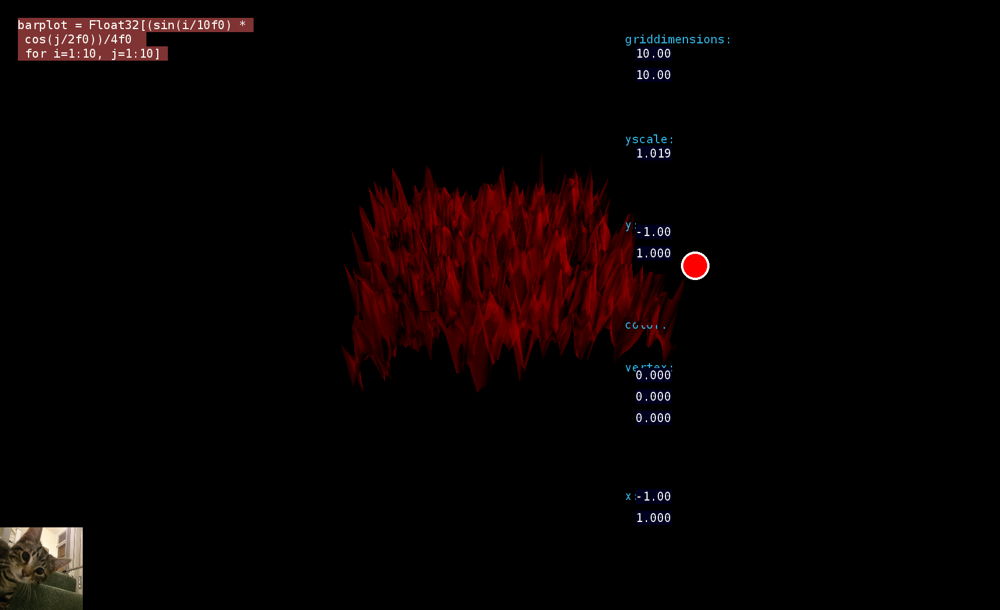

# Beginner with Romeo, an interactive scripting environment featuring OpenGL

The original page for Romeo is <A HREF="https://github.com/SimonDanisch/Romeo.jl">https://github.com/SimonDanisch/Romeo.jl</A>

# Romeo
Romeo is an interactive scripting environment, in which you can execute Julia scripts and edit the variables in 3D.

Screenshot:
 shows current state of my development based on Romeo.jl

### The following issues concern my own development
<TABLE>
<TR><TD>ISSUES
    <TD>Date
    <TD>Description
<TR><TD>
    <TD>
    <TD>
<TR><TD>
    <TD>
    <TD>
<TR><TD>
    <TD>
    <TD>
</TABLE>

### Integration of upstream changes (in  <A HREF="https://github.com/SimonDanisch/Romeo.jl">https://github.com/SimonDanisch/Romeo.jl</A>):

<TABLE>
<TR> 
     <TD>Id
     <TD>Date
     <TD>Issues
     <TD>Description
<TR> 
     <TD>b1fe8580618ec94
     <TD>Sat Mar 14 12:31:48 2015
     <TD>
     <TD>Example simple_display_grid.jl clarifies screen positionning, 
         signal.
</TABLE>

### Use of Julia 0.4 (master)
<TABLE>
<TR> 
     <TD>Id
     <TD>Date
     <TD>Issues
     <TD>Description
<TR> 
     <TD> Version 0.4.0-dev+3821 commit 8a777c274cdd1e77
     <TD> Sat Mar 14 16:15:30 2015
     <TD> Rebuild from source tree
     <TD> Full rebuild was needed, Romeo examples under Julia 0.4. 
          Moving to Julia 0.4 for future devs using Romeo.
</TABLE>

