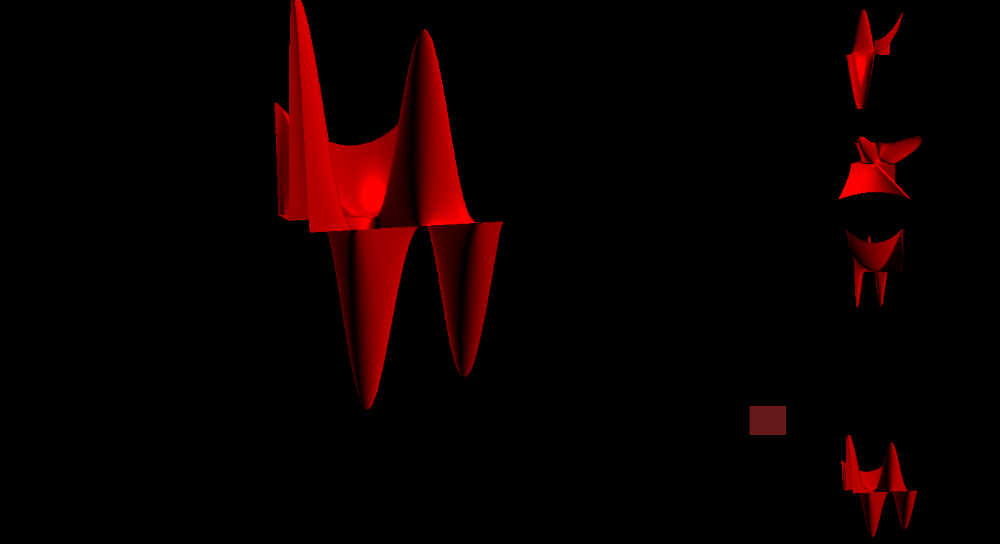
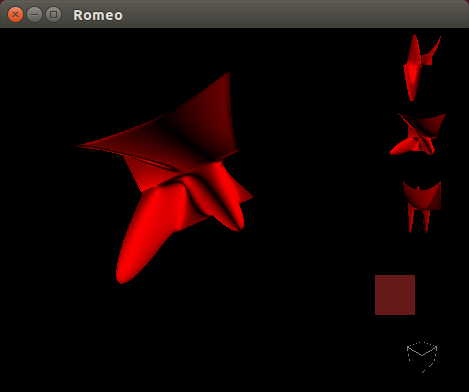

# Beginner with Romeo, an interactive scripting environment featuring OpenGL

The original page for Romeo is <A HREF="https://github.com/SimonDanisch/Romeo.jl">https://github.com/SimonDanisch/Romeo.jl</A>

# Romeo
Romeo is an interactive scripting environment, in which you can execute Julia scripts and edit the variables in 3D.

Screenshots  shows current state of my development based on Romeo.jl
<TABLE>
<TR>
    <TD>
    <TD>
</TABLE>

The first example shows: 1 main object in largest subscreen, 3 views 
of same object from directions along the 3 axes, 1 view with movements
synchronised with main object. This is achieved through parametrization in
the following chunk:
```
   # subscreen geometry 
   scOuter = prepSubscreen([1.; 4.],[3.; 1.])
   scRight = prepSubscreen([1.; 1.;1.;1.],[1.])
   insertChildren!(scOuter, 2, 2, scRight)

   # compute the geometric rectangles by walking down the geometry
   vizObj =computeRects(GLAbstraction.Rectangle{Float64}(0.,0.,1.,1.), scOuter)

   #insert the RenderObjects in the various subscreen
   vizObj[1,1].attrib[RObjFn]         = onlyImg ? pic : doEdit
   vizObj[1,2].attrib[RObjFn]         = onlyImg ? pic : plt #vol(pb projection)
   vizObj[(2,2),(1,1)].attrib[RObjFn] = onlyImg ? pic : colorBtn
   vizObj[(2,2),(2,1)].attrib[RObjFn] = onlyImg ? pic : plt
   vizObj[(2,2),(3,1)].attrib[RObjFn] = onlyImg ? pic : plt
   vizObj[(2,2),(4,1)].attrib[RObjFn] = onlyImg ? pic : plt
   vizObj[2,1].attrib[RObjFn]         = onlyImg ? pic : plt

   # enter rotation parameters for 3 plt, after having required check of feature
   vizObj[(2,2),(2,1)].attrib[ROReqVirtUser] = VFRotateModel| VFTranslateModel
   vizObj[(2,2),(2,1)].attrib[RORot] = (π/2.01,  0.,      0.)

   vizObj[(2,2),(3,1)].attrib[ROReqVirtUser] = VFRotateModel| VFTranslateModel
   vizObj[(2,2),(3,1)].attrib[RORot] = (    0., π/2.01,   0.)

   vizObj[(2,2),(4,1)].attrib[ROReqVirtUser] = VFRotateModel| VFTranslateModel
   vizObj[(2,2),(4,1)].attrib[RORot] = (    0.,   0.,    π/2.01,)

   # specify that mouse actions in cube/axes representation follow large plot
   # this uses an connector for flexibility
   vizObj[1,2].attrib[ROConnects] = 
      InputConnect(vizObj[2,1],(:view,:projection),(:view,:projection))
```

We also have the ability to use an **XML** description like the following 
to achieve *the same*, the result beeing shown on the last screenshot above:
```
<?xml version="1.0" encoding="UTF-8"?>
<scene xmlns:xsi="http://www.w3.org/2001/XMLSchema-instance" 
             xsi:noNamespaceSchemaLocation="subscreenSchema.xsd">

<!-- Subscreen description -->

 <subscreen rows="2" cols="2" name="MAIN">
  <rowsizes>1,4</rowsizes>
  <colsizes>4,1</colsizes>
  <table>
    <tr>
     <subscreen name="A1"/>
     <subscreen name="A2"/>
     </tr>
    <tr>
     <subscreen name="B1"/>
     <subscreen rows="4" cols="1" name="INNER">
         <rowsizes>1,1,1,1</rowsizes>
         <colsizes>1</colsizes>
         <table>
             <tr><subscreen name="IA1"/></tr>
             <tr><subscreen name="IB1"/></tr>
             <tr><subscreen name="IC1"/></tr>
             <tr><subscreen name="ID1"/></tr>
         </table>
     </subscreen>
    </tr>
   </table>
 </subscreen>

<!-- Subscreen contents -->

 <setplot  ref="A1"  fn="doEdit"/>
 <setplot  ref="A2"  fn="doVol"/>
 <setplot  ref="B1"  fn="doPlot"/>

 <setplot  ref="IA1"  fn="doColorBtn"/>
 <setplot  ref="IB1"  fn="doPlot"> 
      <rotateModel>Pi/2, 0.0, 0.0</rotateModel>
 </setplot>
 <setplot  ref="IC1"  fn="doPlot">
      <rotateModel>0.0, Pi/2, 0.0</rotateModel>
 </setplot>
 <setplot  ref="ID1"  fn="doPlot">
      <rotateModel>0.0, 0.0, Pi/2</rotateModel>
 </setplot>

 <!-- Connectors -->
 <connection from="A2" to="B1"> 
            <inSig>:view,:projection</inSig>
            <outSig>:view,:projection</outSig>
 </connection>

 <!-- Debug options -->

<debug>
    <dump ref="IC1"/>
</debug>

</scene>
<!-- This ends the scene-->
```

The following branches in the Git tree have specific meaning (At least planned):
<TABLE>
<TR><TD>master
    <TD>Eventually corresponds to master on the upstream tree 
        (S.Danish development)
<TR><TD>newScrMgr
    <TD>Manage multiple subscreens, and provide inter-subscreen or interaction
        related functionality
<TR><TD>relateSubscreens
    <TD>Establish communications between subscreens(obey same mouse actions), 
        statically rotate the view in some subscreen. Plan to generalize
        to other signals.
<TR><TD>XML
    <TD>Support description of screen in an XML file as shown above.
</TABLE>


### The following issues concern my own development
<TABLE>
<TR><TD>ISSUES
    <TD>Date
    <TD>Description
<TR><TD>
    <TD>Sat Apr 04 2015
    <TD>Not tracking development of GLAbstraction
<TR><TD>
    <TD>
    <TD>
<TR><TD>
    <TD>
    <TD>
</TABLE>


### Integration of upstream changes (in  <A HREF="https://github.com/SimonDanisch/Romeo.jl">https://github.com/SimonDanisch/Romeo.jl</A>):

<TABLE>
<TR> 
     <TD>Id
     <TD>Date
     <TD>Issues
     <TD>Description
<TR> 
     <TD>b1fe8580618ec94
     <TD>Sat Mar 14 12:31:48 2015
     <TD>Closed
     <TD>Example simple_display_grid.jl clarifies screen positionning, 
         signal. Shows capacity of synchronized signals in several subscreen,
         for instance ensure similar rotations upon mouse signal.
<TR> 
     <TD>1096656709a90fb
     <TD>ven. 10 avril 2015 10:37:41 CEST
     <TD>
     <TD>Solves issue with 3D plot.
</TABLE>

### Use of Julia 0.4 (master)
<TABLE>
<TR> 
     <TD>Id
     <TD>Date
     <TD>Issues
     <TD>Description
<TR> 
     <TD>Version 0.4.0-dev+4287 
     <TD> 2015-04-16 09:12 UTC
     <TD> Rebuild from source tree
     <TD> Commit bd748b9*; x86_64-linux-gnu
</TABLE>

