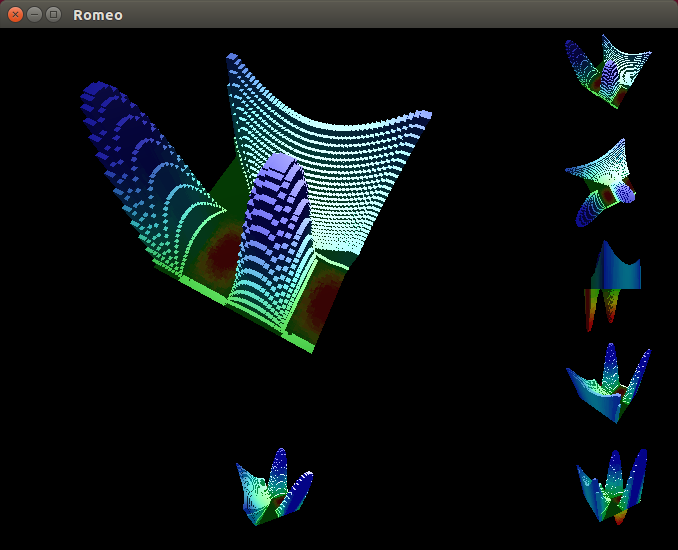
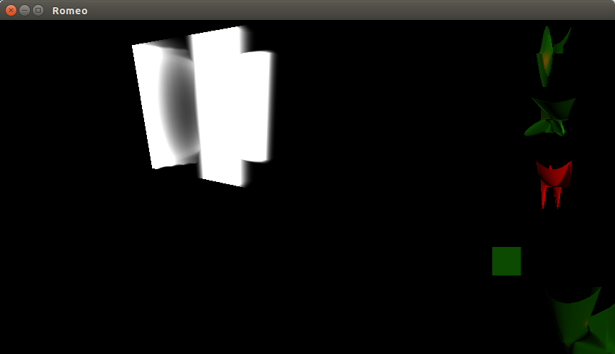
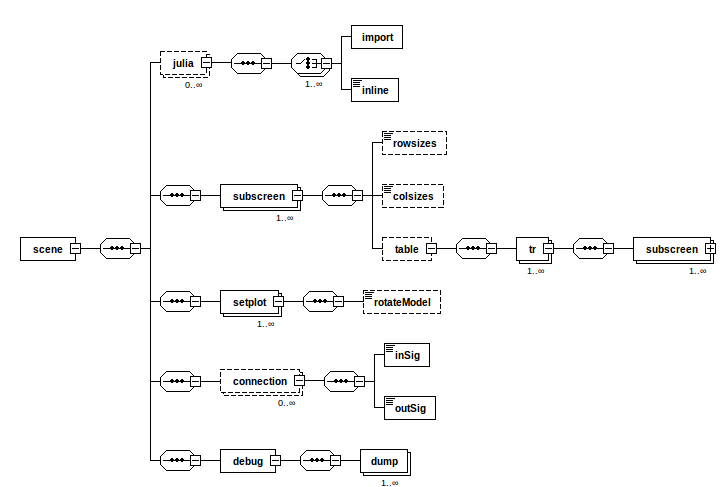

# Add-ons for  Romeo, an interactive scripting environment featuring OpenGL

The original page for Romeo are <A HREF="https://github.com/SimonDanisch/Romeo.jl">https://github.com/SimonDanisch/Romeo.jl</A>
and <A HREF="https://github.com/JuliaGL/GLVisualize.jl">https://github.com/JuliaGL/GLVisualize.jl</A>

# Romeo
Romeo is an interactive scripting environment, in which you can execute Julia scripts and edit the variables in 3D.

Screenshots  shows current state of my extensions to Romeo, heavily using GLVisualize.jl
<TABLE>
<TR>
    <TD>
    <TD>
</TABLE>

The first example shows: 1 main object in largest subscreen, 3 views 
of same object from directions along the 3 axes, 1 view with movements
synchronised with main object. Moreover the color output of the "colorbutton"
is transfered to several of these views. This is achieved through a **XML** 
description like the following:
```
<?xml version="1.0" encoding="UTF-8"?>
<scene xmlns:xsi="http://www.w3.org/2001/XMLSchema-instance" 
             xsi:noNamespaceSchemaLocation="subscreenSchema.xsd">
<!-- Function definitions  -->

<julia  modulename="SubScreensInline">
   <inline>
   <?julia      
      module MachinChose  

      using GLAbstraction, GLWindow, ModernGL, GLVisualize
      using Romeo, TBCompletedM
      export plot2D, plot3D

      Camera = GLAbstraction.Camera
      
         # try with a plot
         npts = 50 
         function plotFn2D(i,j)
               x = Float32(i)/Float32(npts)-0.5 
               y = Float32(j)/Float32(npts)-0.5 
               ret = if ( x>=0 ) && ( x>=y)
                         4*x*x+2*y*y
                     elseif ( x<0) 
                         2*sin(2.0*3.1416*x)*sin(3.0*3.1416*y)
                     else
                         0.0
                     end
                ret
         end
         function doPlot2D (sc::Screen,cam::Camera)
                 ret = TBCompleted ( Float32[ plotFn2D(i,j)  for i=0:npts, j=0:npts ],
                               nothing, Dict{Symbol,Any}(:SetPerspectiveCam => true)
                             )
                 ret
         end  
         npts3D = 12
         function plotFn3D(i,j,k)
               x = Float32(i)/Float32(npts3D)-0.5 
               y = Float32(j)/Float32(npts3D)-0.5 
               z = Float32(k)/Float32(npts3D)-0.5 

               ret = if ( x>=0 ) && ( x>=y)
                         2*x*x+3*y*y+z*z
                     elseif ( x<0) 
                         2*sin(2.0*3.1416*x)*sin(3.0*3.1416*y)
                     else
                         9*x*y*z
                     end
                ret
         end
         function doPlot3D (sc::Screen,cam::Camera)
                 dd = Dict{Symbol,Any}(:SetPerspectiveCam => true) 
                 ret= TBCompleted ( Float32[ plotFn3D(i,j,k) for i=0:npts3D, 
                                         j=0:npts3D, k=0:npts3D ],
                               nothing, dd)
                 ret
         end  
      end    #  module MachinChose
   ?>
   </inline>
</julia>
<!-- Subscreen description -->
 <subscreen rows="2" cols="2" name="MAIN">
  <rowsizes>1,4</rowsizes>
  <colsizes>4,1</colsizes>
  <table>
    <tr>
     <subscreen name="A1"/>
     <subscreen name="A2"/>
     </tr>
    <tr>
     <subscreen name="B1"/>
     <subscreen name="INNER"/>
     </tr>
   </table>
 </subscreen>

 <subscreen rows="4" cols="1" name="INNER">
  <rowsizes>1,1,1,1</rowsizes>
  <colsizes>1</colsizes>
  <table>
    <tr>
     <subscreen name="IA1"/>
    </tr>
    <tr>
     <subscreen name="IB1"/>
    </tr>
    <tr>
     <subscreen name="IC1"/>
    </tr>
    <tr>
     <subscreen name="ID1"/>
    </tr>
   </table>
 </subscreen>

<!-- Subscreen contents -->

 <setplot  ref="A1"  fn="doPlot"/>
 <setplot  ref="A2"  fn="doPlot"/>
 <setplot  ref="B1"  fn="doPlot"/>

 <setplot  ref="IA1"  fn="doColorBtn"/>
 <setplot  ref="IB1"  fn="doPlot"> 
      <rotateModel>Pi/2, 0.0, 0.0</rotateModel>
 </setplot>
 <setplot  ref="IC1"  fn="doPlot">
      <rotateModel>0.0, Pi/2, 0.0</rotateModel>
 </setplot>
 <setplot  ref="ID1"  fn="doPlot">
      <rotateModel>0.0, 0.0, Pi/2</rotateModel>
 </setplot>

 <!-- Connectors -->
 <connection from="B1" to="A2"> 
            <inSig>:view  </inSig> <!-- , :projection,    :projectionview, :projection-->
            <outSig>:view </outSig> <!-- , :projectionview,:projection,    :projection-->
 </connection>

 <!-- Debug options -->

<debug>
    <dump ref="IC1"/>
</debug>

</scene>
<!-- This ends the scene-->
```

<TABLE>
<TR>
    <TD> Current (almost) summary of XSD for XML specification of screen
<TR>
    <TD>
</TABLE>


The following branches in the Git tree have specific meaning (At least planned):
<TABLE>
<TR><TD>master
    <TD>Eventually corresponds to master on the upstream tree 
        (S.Danisch development)
<TR><TD>skinny
    <TD>Move to new organization using  GLVisualize, AbstractGPUArray, GeometryTypes, 
        ColorTypes, Meshes, MeshIO. <B>Currently, just achieved first OGL display.</B>
<TR><TD>XML
    <TD>XML related functions, waiting for integration with "skinny" branch
       Adds: Management of multiple subscreens, and inter-subscreen  interaction.
             Generalization to other signals via *Connectors* and the *connection* tag .        
</TABLE>


### The following issues concern my own development
<TABLE>
<TR><TD>ISSUES
    <TD>Date
    <TD>Description
<TR><TD>Julia Version 0.4.0-dev+4500 (Commit 30b94a1*) 
    <TD>2015-04-25 15:54 UTC
    <TD>Issues:Currently working on remaining compatibility issues
<TR><TD>Romeo 
    <TD>reorganized, 
    <TD>skinned down most previous functionality moved to GLVisualize
<TR><TD>XML Schema based validation 
    <TD> uses xmllint, xmlCopyEditor
    <TD> 
</TABLE>


### Use of Julia 0.4 (master)
<TABLE>
<TR> 
     <TD>Id
     <TD>Date
     <TD>Issues
     <TD>Description
<TR> 
     <TD>Version 0.4.0-dev+4287 
     <TD> 2015-04-16 09:12 UTC
     <TD> Rebuild from source tree
     <TD> Commit bd748b9*; x86_64-linux-gnu
<TR> 
     <TD>Version 0.4.0-dev+4500
     <TD>2015-04-25 15:54 UTC
     <TD> Rebuild from source tree. Requires updates in multiple libraries 
     <TD> Commit  30b94a1*; x86_64-linux-gnu
<TR> 
     <TD>Version 0.4.0-dev+4704
     <TD>2015-05-07 03:55 UTC
     <TD> Rebuild from source tree. 
     <TD> Commit cd2c363* ; x86_64-linux-gnu
</TABLE>

Non master branches used:
<TABLE>
<TR> 
     <TD>  Package <TD> Branch
<TR> 
     <TD>  GLVisualize <TD>  upstream/master + mods
<TR> 
     <TD>  GLAbstraction <TD>  upstream/julia04
<TR> 
     <TD>GLWindow  <TD>    upstream/julia04
<TR> 
     <TD>GLFW      <TD>    origin/master 5/7/15
</TABLE>
